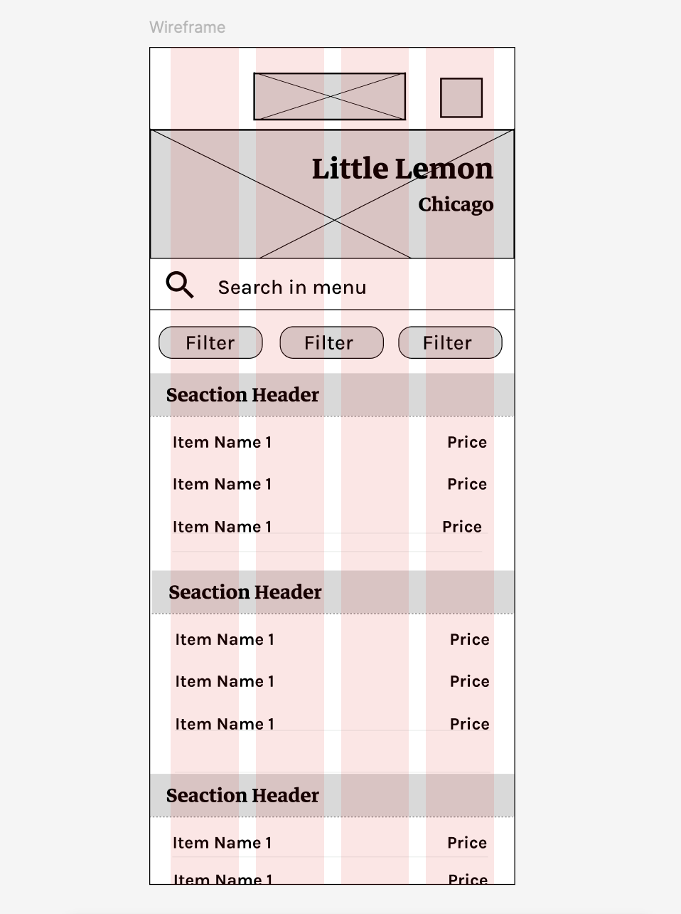
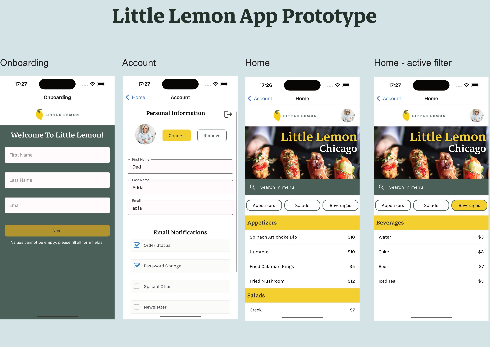

# Little Lemon Restaurant App

### How to run the app

You need node and expo installed on your machine to correctly run this project.

In terminal run ```git clone https://github.com/blitzmartin/little-lemon-app.git``` to copy the project locally.

To start the project: 
* ```cd``` into the project folder
* run ```npm install``` to get the needed node_modules
* run ```npm run start``` to execute the app

If you want to test the app locally in a simulator, you need either XCode or Android Studio.
Below you fill find the Wireframe of the home screen and the Prototype of the different screens.

___

### Wireframe




---------

### Prototype


